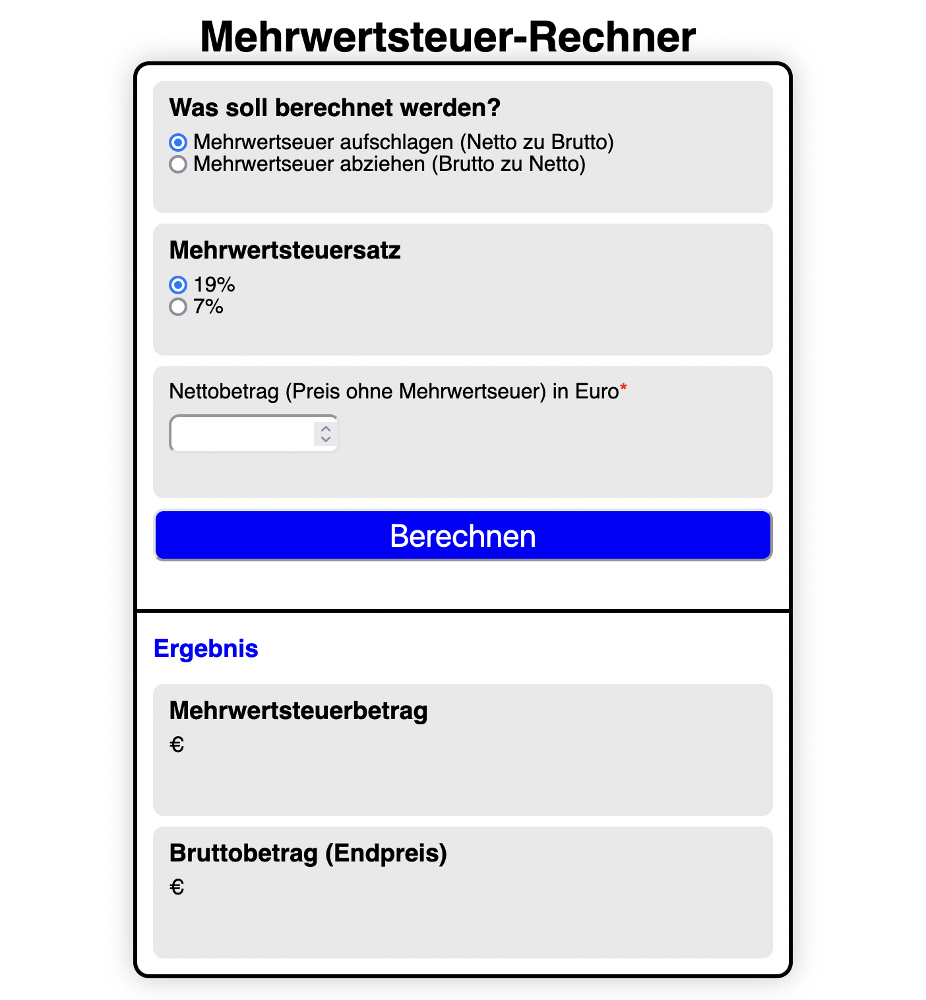

# Projekt_Mehrwertsteuer-Rechner

- Brutto zu Netto (mit 7% oder 19% MwSt.)
- Netto zu Brutto (mit 7% oder 19% MwSt.)
- gibt den MwSt. Betrag aus + Netto- oder Bruttobetrag
- Error handling bei fehlendem User Input

# Tech Stack

- HTML5
- CSS3
- JavaScript

# Demo-Link

https://yacineyldrm.github.io/Projekt_Mehrwertsteuer-Rechner/

# Screenshot

